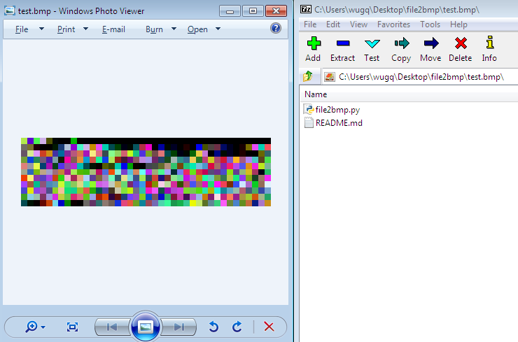

## What is this ? ##
A script who can convert any file to BMP format.

## How it works ? ##
Create a BMP image, append all meta data of source file as bitmap-data of the image.

## Any fun ? ##
Especially, if you convert a rar/zip archive file, you can **extract** the **orginal archive** file from the **result image** with a file archiver like 7-Zip or WinRAR.

Here is a demo screenshot: 

